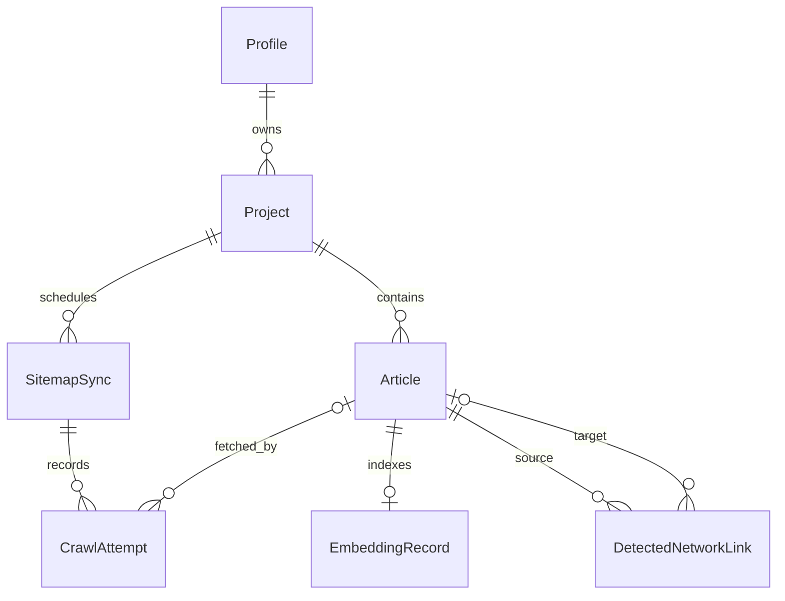

# ADR 0001: Define the MVP domain and service boundaries

- Status: Proposed
- Date: 2026-08-01
- Decision owners: Rasul and Greg
- Scope: CiteGuild MVP
- Product source: [CiteGuild - AI-Native Editorial Link
  Network](https://outline.gregagi.com/doc/citeguild-ai-native-editorial-link-network-ss3kILTcjB)

## Decision

Build CiteGuild as a Django modular monolith. PostgreSQL is the canonical
system of record, Django Q2 with Redis delivers at-least-once background work,
and self-hosted Qdrant is a rebuildable index containing one vector per whole
article. The dashboard, API, MCP server, and CLI call the same domain services
and search contract.

This ADR defines contracts for later implementation tasks; it does not claim
that the product models or Qdrant integration already exist.

## Product invariants

- One $10 monthly subscription; no free plan, trial, annual plan, per-site
  pricing, or additional tier.
- A paid profile may add unlimited sitemap-backed projects/sites.
- Base-URL crawling without a sitemap is deferred.
- Each article has one embedding for its complete extracted text. Chunking and
  reranking are deferred.
- Search returns relevant candidates; CiteGuild never forces, inserts, sells,
  or guarantees a citation.
- Daily reconciliation marks removed or confirmed unavailable articles
  inactive without deleting history.
- Member-to-member links are detected observations, not attributed
  conversions.

## Systems of record

| System | Responsibility |
| --- | --- |
| PostgreSQL | Profiles and access, projects, sync/crawl state, extracted article text and metadata, embedding state, detected links, and idempotency records |
| Stripe | External customer, subscription, invoice, and paid-period truth |
| Qdrant | One derived whole-article vector and public-safe payload per indexed article; never billing, authorization, lifecycle, or raw article truth |
| Redis and Django Q2 | Cache/broker and at-least-once job delivery; never durable workflow truth |
| S3-compatible storage | Existing user-uploaded media support; not MVP article or vector truth |

PostgreSQL wins whenever systems disagree. Qdrant is rebuildable from
PostgreSQL, and Redis loss may delay work but must not lose desired state.

## Domain model

Use the existing `Profile` as the account boundary. Do not add another
`Account` model for MVP.

### Stable identifiers

- Integer primary keys remain internal.
- Use `BaseModel.uuid` in URLs, public payloads, queue arguments, logs,
  idempotency keys, and Qdrant point IDs.
- Before the first new domain migration, make `BaseModel.uuid` database-unique;
  the generated field currently lacks that constraint.
- Mutable URLs, titles, domains, Stripe IDs, and vector offsets are not entity
  identifiers.

### Profile and subscription gate

`Profile` owns authentication, the API-key hash, Stripe references, and access
state. Stripe webhooks update the persisted application gate.

- `subscribed` may create projects and search.
- `cancelled` retains access through the paid period, as the scaffold models.
- `churned` and all unpaid states cannot create projects or search; owned
  content becomes ineligible without being deleted.
- Generated trial/free states are not CiteGuild product paths and grant no
  access.

Store every processed Stripe event ID under a unique constraint before applying
its transition. Duplicate delivery is a no-op.

### Project

One `Project` represents one submitted site. It stores owner, display name,
submitted/normalized sitemap URL, normalized site host, lifecycle state
(`active` or `suspended`), suspension reason/timestamps, and last/current sync
references.

Enforce one active or suspended project per normalized site host across the
network. Conflicts require operator resolution instead of duplicate corpus
ownership. Index owner/state and scheduler fields. Management always derives
ownership from the authenticated `Profile`.

### SitemapSync

One `SitemapSync` is a durable reconciliation run. It stores project, trigger
(`initial`, `daily`, `manual`, or `repair`), scheduled time, attempt count,
bounded result counts/failure code, timestamps, and state: `queued`, `running`,
`succeeded`, `partial`, `failed`, or `cancelled`.

- `idempotency_key` is unique.
- Only one sync may be queued/running per project.
- Daily key: `sync:{project_uuid}:{UTC_date}`.
- Retry the same failed run; an operator may create a new explicit repair run.

### Article

`Article` stores project, submitted/final/canonical URLs, normalized canonical
URL, title, description, language, extracted whole-article text, normalized
content hash, bounded HTTP metadata, lifecycle state, inactivity reason, and
first/last-seen/fetched/changed/inactive timestamps.

States:

- `discovered`: present in a valid sitemap but not yet searchable.
- `active`: latest accepted content has a ready matching embedding.
- `inactive`: absent from a valid reconciliation or confirmed unavailable.

Enforce unique `(project, normalized_canonical_url)` and index normalized
canonical URL for link resolution. Canonical/final URLs must satisfy the
project host policy. Reappearance moves an inactive row back through discovered
to active without changing its UUID. A refresh failure alone does not trigger
inactivity.

### CrawlAttempt

`CrawlAttempt` is append-oriented evidence for one bounded sitemap or article
fetch. It stores sync, optional article, resource kind, normalized requested
URL, attempt number, unique idempotency key, HTTP status, byte/duration/redirect
counts, bounded failure code, timestamps, and state: `queued`, `running`,
`succeeded`, or `failed`. A terminal attempt is immutable.

Enforce unique `(sync, resource_kind, normalized_requested_url,
attempt_number)`. Never persist raw HTML, response bodies, credentials, or raw
exceptions in attempts or logs.

### EmbeddingRecord and Qdrant

`EmbeddingRecord` is one-to-one with `Article`. It stores provider, model,
dimensions, collection, point ID, indexed content hash, attempt count, bounded
failure code, indexed timestamp, and state: `pending`, `indexing`, `ready`,
`stale`, or `failed`.

- Qdrant point ID equals `Article.uuid`.
- `(collection_name, qdrant_point_id)` is unique.
- Embedding key `embed:{article_uuid}:{content_hash}:{model_version}` is unique.
- A content-hash change marks the record stale and requests one replacement
  vector for the complete normalized article text.
- Search returns a row only when the embedding and article hashes match and the
  embedding is ready.

Qdrant payload is limited to article/project UUIDs, public domain, canonical
URL, title, language, content hash, eligibility, and last-seen time. It excludes
article text, account/billing data, credentials, and crawl failures.

### DetectedNetworkLink

`DetectedNetworkLink` stores source article, nullable resolved target article,
normalized destination URL, bounded anchor text, active state,
first/last/inactive timestamps, and last observing sync.

Enforce unique `(source_article, normalized_destination_url)`. A successful
source refresh reconciles the full observed set: missing links become inactive,
and later observations reactivate the same row. Target resolution may happen
later. Never infer CiteGuild attribution.

### API and agent credentials

- Dashboard: existing authenticated Django session.
- HTTP API and CLI: existing profile API key; persist only prefix and salted
  hash, and reveal plaintext only at creation/rotation.
- MCP: existing OAuth flow, with legacy profile API-key compatibility during
  MVP.
- Persist MCP client secrets, authorization codes, access tokens, and refresh
  tokens as lookup prefix plus salted hash; reveal bearer values only when
  issued. The generated plaintext OAuth-token fields must be hardened before
  production use.
- Authentication yields a `Profile`; shared services enforce authorization and
  subscription access again.

Credentials identify a caller. They are never project ownership keys or
Qdrant authorization by themselves. Stripe, Qdrant, OpenRouter, and other
service credentials stay in encrypted deployment secrets/environment, never in
domain rows, job arguments, logs, or committed files. Stripe customer and
subscription IDs are identifiers, not credentials.

## URL identity and crawl policy

One canonicalization function serves sitemap parsing, article upserts, search
exclusions, and detected-link matching:

1. Accept only HTTP(S) without embedded credentials.
2. Lowercase and IDNA-normalize the host, remove default ports/fragments, and
   normalize an empty path to `/`.
3. Preserve path case and query semantics. Remove only an explicit allowlist of
   tracking parameters.
4. Resolve relative links against the final fetched URL.
5. Accept a canonical hint only if it passes the same network and project-host
   policy; otherwise use the final URL.
6. Merge same-project canonical collisions transactionally into the existing
   article while preserving its UUID.

Revalidate every DNS result and redirect. Reject loopback, private, link-local,
multicast, unspecified/reserved, cloud-metadata, non-HTTP(S), and mixed
public/private destinations. Bound bytes, decompression, XML entries/depth,
redirects, timeouts, retries, and project/global concurrency. Never execute
page scripts.

## Service boundaries

| Service | Responsibility |
| --- | --- |
| `SubscriptionAccessService` | Decide whether a profile may create projects or search |
| `ProjectService` | Create, suspend, reactivate, and authorize projects |
| `SitemapSyncService` | Create, lock, reconcile, and finalize sync runs |
| `SafeFetchService` | Apply SSRF and resource limits to sitemap/article fetches |
| `ArticleIngestionService` | Canonicalize, extract, hash, persist, and request indexing |
| `EmbeddingIndexService` | Reconcile whole-article embeddings and Qdrant points |
| `SearchService` | Authorize, embed query, search, rehydrate, filter, and shape results |
| `CitationService` | Reconcile observations and resolve member targets |

External HTTP, embedding, Stripe, and Qdrant clients sit behind narrow
adapters. Views, Ninja routes, MCP tools, CLI commands, and Q2 tasks translate
inputs and call services; they do not duplicate product rules.

## Request and job boundaries

Synchronous requests authenticate, enforce access, normalize input, commit
durable intent, enqueue with `transaction.on_commit`, and return. Semantic
search is synchronous but bounded by result, provider, and Qdrant timeouts.

Background flow:

1. Scheduler creates one daily `SitemapSync` for each eligible project.
2. `run_sitemap_sync(sync_uuid)` locks the run/project, safely fetches a valid
   desired URL set, upserts discovery state, and dispatches crawls.
3. `crawl_article(sync_uuid, article_uuid)` safely fetches, extracts,
   canonicalizes, hashes, persists, and reconciles outbound observations.
4. `index_article(article_uuid, content_hash)` verifies the current hash,
   creates one whole-article vector, and upserts the stable Qdrant point.
5. A finalizer derives sync counts/state. A repair sweep re-enqueues committed
   queued/pending/stale work that was not delivered.

Django Q2 is at least once. Each job locks its target, verifies expected
state/hash, and succeeds without side effects when the desired state already
exists. Redis receives UUIDs and expected hashes, never HTML, article text,
credentials, or mutable model objects.

## Shared search contract

MCP, CLI, API, and dashboard diagnostics call one `SearchService`.

Input: required query/passage, bounded result limit, optional language, and
optional excluded domains (especially the writer's domain).

Each result returns article UUID, title, canonical URL, public domain,
language, bounded excerpt/summary, relevance score, and last-seen timestamp.

The service requires an eligible authenticated profile, filters Qdrant to
eligible active points, then rehydrates PostgreSQL. It drops stale/missing
points, hash mismatches, inactive articles, suspended projects, and ineligible
owners. It never returns raw stored text, account data, or internal failure
details. Query/draft text, article text, embeddings, excerpts, and result URLs
must not enter logs or analytics.

## Failure and recovery

- Failures use bounded codes, not raw response or exception content.
- A sync is partial when some terminal items succeed and some fail. It fails
  when the sitemap cannot produce a valid desired set or nothing can succeed.
- Never mark removals from an invalid or failed sitemap fetch; only a complete
  valid desired set can make absent articles inactive.
- Failed refresh/indexing preserves the last known records for repair, even
  when hash/state checks temporarily exclude them from search.
- PostgreSQL commit precedes queue delivery and Qdrant publication. Repair
  sweeps recover committed intent after crashes.
- Qdrant upserts/deletes are idempotent; periodic repair reconciles PostgreSQL
  and orphan/stale points.
- Hard deletion is reserved for explicit privacy/legal erasure. Normal billing,
  crawl, and sitemap changes preserve history.

## Deployment boundary

The CapRover MVP contains:

- `citeguild`: public ASGI dashboard/API/OAuth/MCP server
- `citeguild-workers`: same image with `APP_PROCESS_TYPE=worker`
- private PostgreSQL with durable data/backups
- private Redis for cache/Q2
- private Qdrant with durable storage and rebuild/backup procedures

Deployment is complete only when dependencies have health checks and durable
volumes, migrations run once per release, and backup/restore paths are tested.

## Consequences and deferred work

The modular monolith favors MVP speed and consistent authorization over
independent scaling. PostgreSQL rehydration adds work but blocks stale or
unauthorized vector results. Whole-article vectors are simple but less precise
for long articles. Global site-host uniqueness needs operator handling for
ownership disputes.

Deferred: chunk embeddings, reranking, advanced quality filters, no-sitemap
crawling, automatic publishing, credits/reciprocity/outreach/chat/placements,
public network profiles, link attribution, separate deployable services,
Kafka/workflow engines, and all alternate pricing.

## Validation for implementation PRs

Test each implemented transition, especially paid/tenant boundaries, duplicate
webhook/scheduler/job delivery, canonical collisions, hostile redirects,
valid-versus-failed reconciliation, inactivity/reactivation, hash/vector repair,
cross-tenant public-safe retrieval, and link deactivation/reactivation.

If implementation changes a decision, update this ADR and the narrower
canonical file (`PRODUCT.md`, `TECH.md`, `STRUCTURE.md`, or `ANALYTICS.md`) in
the same PR rather than silently diverging.
